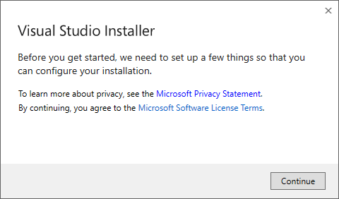
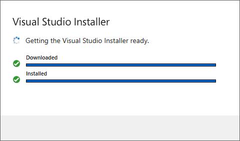
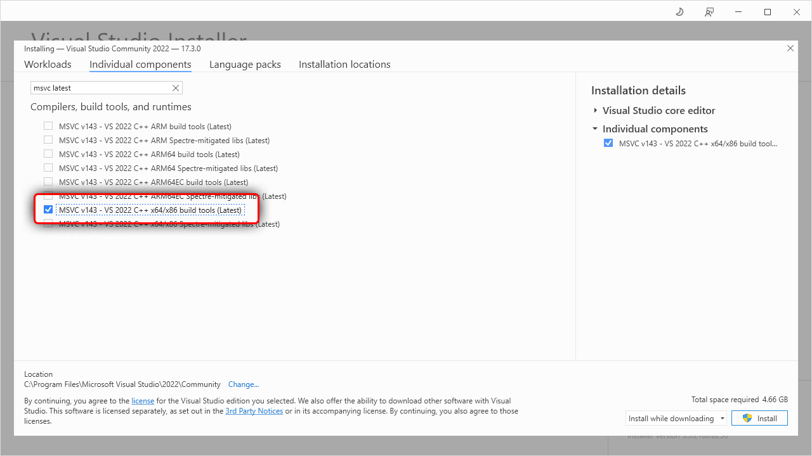
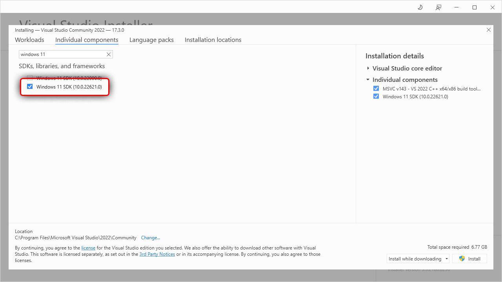
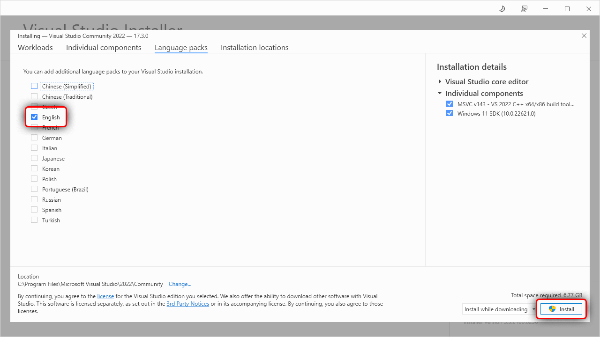
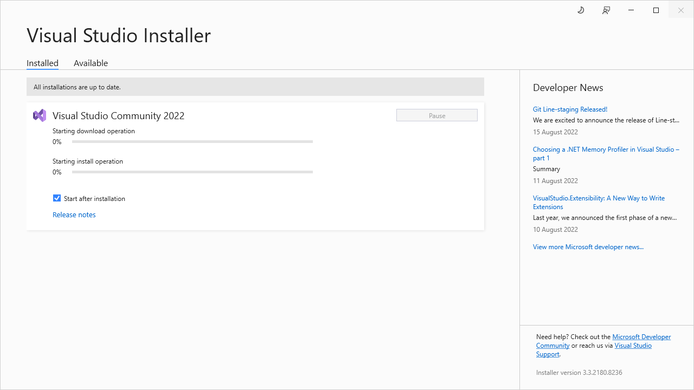

# MSVC prerequistes

To compile programs into an exe file, Rust requires a linker, libraries and Windows API import libraries.
For `msvc` targets these can be acquired through Visual Studio.

## Automatic install

If you don't have Visual Studio already installed then [rustup-init] will offer to automatically install the prerequisites.
Doing so means you can skip the rest of this page.
However, it installs Visual Studio Community edition which may not be appropriate for all users.

## Manual install

[Download Visual Studio][vs downloads].
Rust supports Visual Studio 2013 and later but it is recommended that you use the latest version (currently 2022) for new projects.
You can opt to download only the Build Tools for Visual Studio, which does not include the IDE.
However this requires you already have a license to the Community, Professional or Enterprise edition.

Once you've downloaded and started the installer, the easiest way to get everything installed is to select "Desktop Development with C++".
This will include the necessary components.
On the "Language Packs" tab, make sure the English language pack is installed in addition to your preferred language.

If you want more details on the installation process or want to further customize the install then follow the walkthrough below.
Otherwise complete the Visual Studio install and continue with installing Rust.

## Walkthrough: Installing Visual Studio 2022

This walkthrough uses the Community edition of Visual Studio but the Professional, Enterprise and the Build Tools all work the same way.

The installer will start by linking to the [license][vs licences] and for your edition of Visual Studio and then preparing the installer.

Once this finishes, you can then select the components to be installed.
Here we use the "Workload" tab to select the "Desktop Development with C++" workload.
This will includes all needed components for Rust:

### Installing only the required components (optional)

If you'd like a more minimal install (and won't doing C++ development) then you can use the "Individual Components" tab to select just the essentials, which are:

* MSVC v143 - VS 2022 C++ x64/x86 build tools (Latest)
* Windows 11 SDK (10.0.22621.0)

Note that the specific version of the Windows SDK doesn't matter for pure Rust code but if using C++ as well you'll likely want either the latest or whichever version is required by the C++ project (or both).

### Completing the install

After choosing the components, switch to the "Language Packs" tab and add the English language pack in addition to your preferred language.

Finally click the install button and wait for everything to be installed.

Once finished, you can continue on to installing Rust.

[rustup-init]: https://rustup.rs
[vs downloads]: https://visualstudio.microsoft.com/downloads/
[vs licences]: https://visualstudio.microsoft.com/license-terms/
